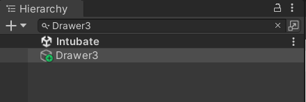
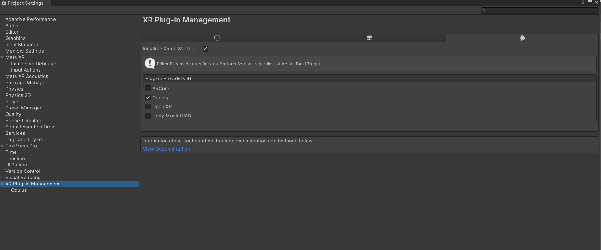
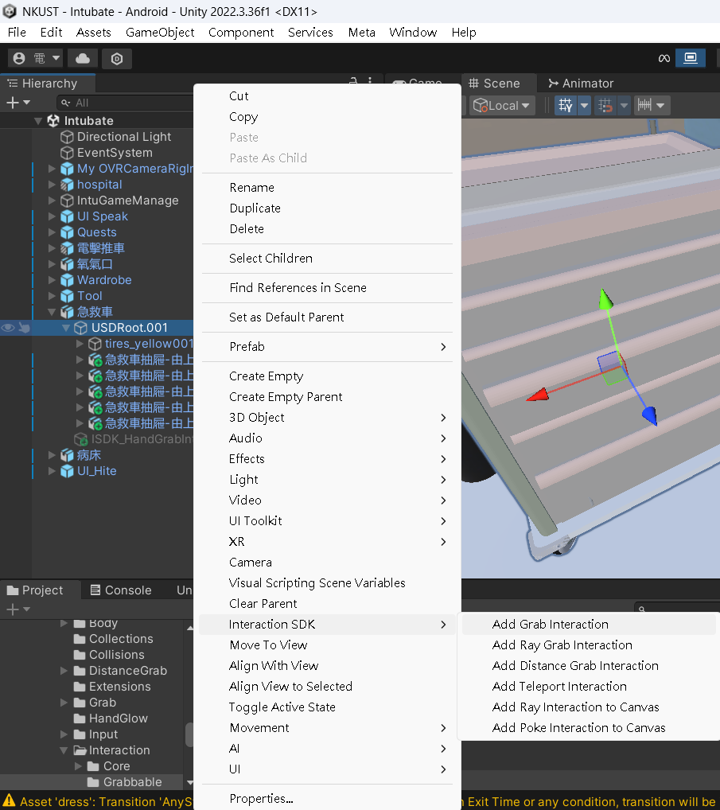
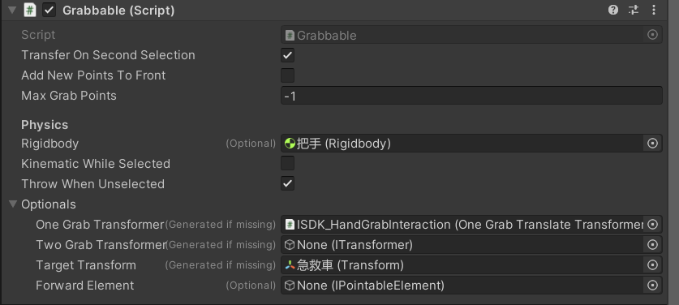
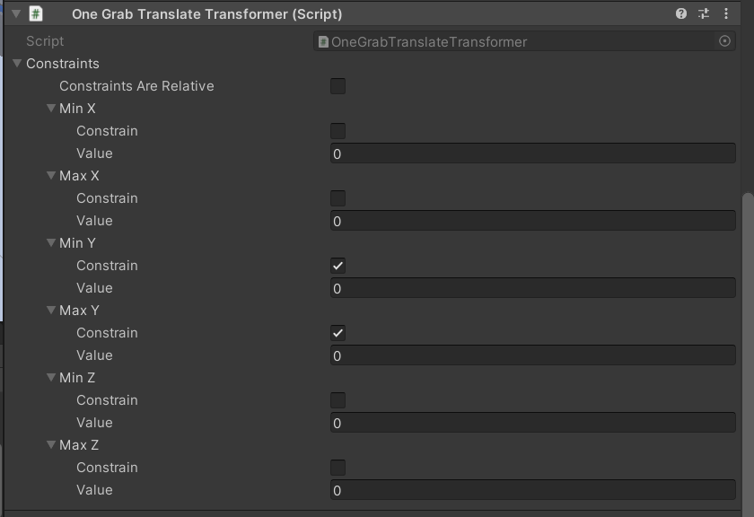
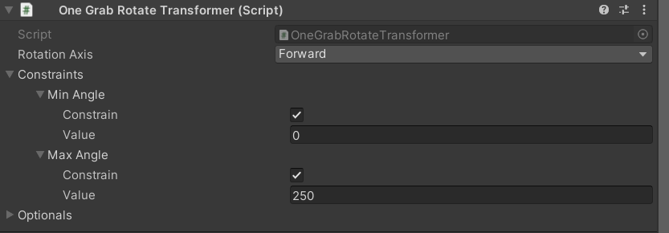
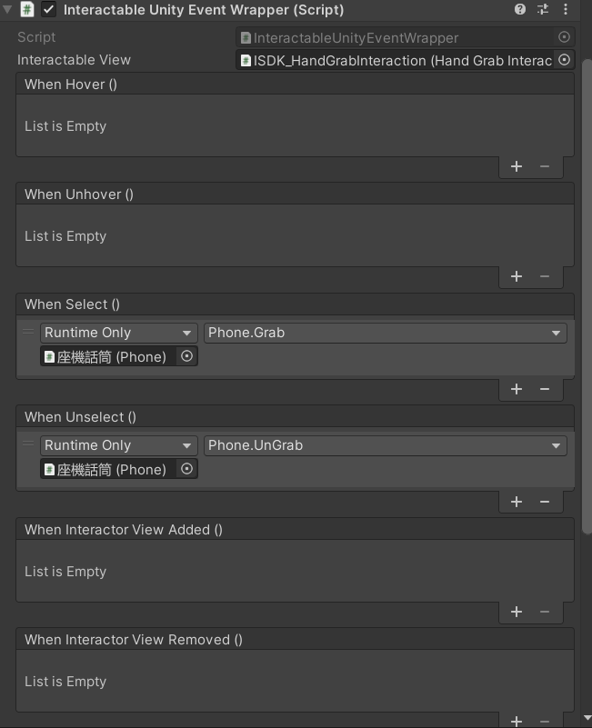
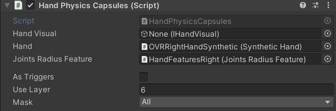
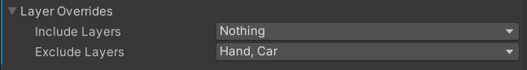

# NKUST (VR 呼吸處置訓練系統)
[簡介](#簡介)  
[功能特色](#功能特色)  
[安裝方式/開發環境](#安裝方式開發環境)  
[檔案打開方法](#檔案打開方法)  
[專案結構](#專案結構)  
[使用方式(腳本功能)](#使用方式腳本功能)  
[使用方式(場景物件的腳本與組件設定)](#使用方式場景物件的腳本與組件設定) 

## 簡介
這是一款在 Meta Quest 3 上運行的 VR 模擬教學遊戲，結合 Unity 3D 互動與 Blender 模型，透過身歷其境的方式訓練護理人員在真實情境下對血癌病患進行評估與處置。後端使用 XAMPP（Apache + PHP + MySQL）快速部署管理和成績查詢。

注意：遊戲過程中如果沒有網路，成績將無法上傳，也不會保留在本地。  
在內文中物件通常以`"範例"`表示  
腳本與參數欄位通常以`範例`表示  
**請不要隨意更改物件名，部分腳本依靠物件名**  
**請善用Hierarchy的尋找物件與腳本功能**  
  
## 功能特色
- 支援 Meta Quest VR 裝置  
- 具備呼吸處置流程模擬  
- 包含教學圖片與醫療圖卡資源   

## 安裝方式/開發環境

- **Unity 版本**：2022.3.36f1  
- **語言**：C#  
- **使用插件（Packages）**：  
  - Meta All-in-One SDK 68.0.0  
  https://assetstore.unity.com/packages/tools/integration/meta-xr-all-in-one-sdk-269657?srsltid=AfmBOopPixsjrctcczGdI6ercUQ8Sg6Mz_RONM7Cw6VXbHCjJ1G79_JF
  - Code Coverage 1.2.5  
  - Custom NUnit 1.0.6  
  - Editor Coroutines 1.0.0  
  - JetBrains Rider Editor 3.0.28  
  - Newtonsoft Json 3.2.1  
  - Oculus XR Plugin 4.2.0  
  - Profile Analyzer 1.2.2  
  - Settings Manager 2.0.1  
  - Test Framework 1.1.33  
  - TextMeshPro 3.0.6  
  - Timeline 1.7.6  
  - Unity UI 1.0.0  
  - Version Control 2.5.2  
  - Visual Scripting 1.9.4  
  - Visual Studio Code Editor 1.2.5  
  - Visual Studio Editor 2.0.22  
  - XR Legacy Input Helpers 2.1.10  
  - XR Plugin Management 4.5.0  
  
  (要用模擬器才需下載) Oculus XR Plugin與XR Plugin Management可進入Project Settings 點擊下載
- **後端部署（hpds_anne）**
  - 啟動 XAMPP 中的 Apache 與 MySQL
  - 將 `hpds_anne` 資料夾放到 XAMPP 的 `htdocs/` 目錄
  - 透過 phpMyAdmin 或指令匯入 `hpds_anne.sql` 建立資料庫與初始帳號
## 檔案打開方法

本專案提供兩種啟動方式：

**方式一：已含完整開發環境，無需安裝任何額外套件**  
**方式二：僅提供 Unity 專案封裝檔，需手動建立專案並安裝相關套件**

---

### ✅ 方式一（使用 NKUST 資料夾）
1. **下載 NKUST 完整資料夾**：[點此下載](https://drive.google.com/file/d/1Pif2I_e4fqJTSnzFNCUXjNVVuOHJnpc9/view?usp=drive_link)  
2. 開啟 Unity Hub，點選「從硬碟新增專案」，選擇 `NKUST` 資料夾  
3. 開啟 `NKUST` 專案  
4. 選擇場景 `Scenes/Menu.unity`，打開模擬器（Play 按鈕左側）  
5. 點擊 `Play` 執行


---

### ✅ 方式二（使用 NKUST.unitypackage）
1. **下載 NKUST Unitypackage**：[點此下載](https://drive.google.com/file/d/1M3tx4MSNtBWMtTMgf-QVGGobGBpp-KlZ/view?usp=drive_link)  
2. 開啟 Unity Hub，建立一個新專案   
3. 選擇範本 `3D (Built-In Render Pipeline)`  
4. 建立完成後，前往 `Assets` → `Import Package` → `Custom Package`  
5. 選擇 `NKUST.unitypackage`，點選「全部匯入」  
6. 選擇場景 `Scenes/Menu.unity`，打開模擬器並點擊 `Play`


## 專案結構
```plaintext
Assets/
├── Image/                           # 圖像資源
│   ├── AEDtep/                      # AED 教學模組圖片
│   ├── Q5/                          # 題組 5 圖片
│   ├── Q9_5/                        # 題組 9-5 圖片
│   ├── Q12/                         # 題組 12 圖片
│   ├── Q13/                         # 題組 13 圖片
│   ├── 心電儀/                      # 心電圖相關圖片
│   ├── 急救車/                      # 救護車相關圖片
│   ├── 電梯/                        # 電梯場景圖片
│   └── 輸送分級表/                 # 病患輸送分級圖表
├── Material/                        # 材質資源
│   ├── EKG/                         # 心電圖相關材質
│   ├── Oculus/                      # Oculus 裝置相關材質（修改 ZTest用）
│   └── Canvas/                      # 用於 Canvas 的材質（修改 ZTest用）
├── Prefab/                          # 預製物件
│   ├── AED/                         # AED 模組預製件
│   ├── Blender/                     # Blender 模型相關預製件
│   ├── Electric/                    # 電氣設備模組預製件
│   ├── Intubate/                    # 插管模組預製件
│   ├── Menu/                        # 主選單預製件
│   ├── 其他(大概廢棄)/              # 其他或暫時廢棄的預製件
│   └── 電梯/                        # 電梯模組預製件
├── Scenes/                          # Unity 場景檔
│   ├── Elevator/                    # 電梯模組場景
│   ├── Intubate/                    # 插管模組場景
│   └── Menu/                        # 主選單場景
├── Script/                          # 腳本總資料夾
│   ├── Elevator/                    # 電梯模組腳本
│   ├── Intubate/                    # 插管模組腳本
│   ├── Menu/                        # 主選單腳本
│   └── Video/                       # 影片播放控制腳本
├── Sound/                           # 音效資源
│   ├── machine/                     # 機器設備音效
│   ├── Speak/                       # 語音提示音效
│   ├── 正常呼吸音/                 # 正常呼吸音效
│   ├── 正確/                        # 答對提示音效
│   └── 錯誤/                        # 答錯提示音效
├── Video/                           # 影片資源
│   ├── Q9/                          # 題組 9 影片
│   ├── 心電/                        # 心電圖相關影片
│   ├── 提示/                        # 操作提示影片
│   └── 插管/                        # 插管教學影片
└── woman/                           # 病人角色相關資源
```
## 使用方式(腳本功能)
### 腳本列表  
- [Elevator 類腳本](#elevator-類腳本)  
- [Intubate 類腳本](#intubate-類腳本)  
  - [Line](#scriptintubatelinelineconnect)
  - [Main](#scriptintubatemainspeak1含-speak2-speak3)
  - [secondary](#scriptintubatesecondarybvmbvm)
- [Menu 類腳本](#menu-類腳本)
- [Video 類腳本](#video-類腳本)

---

### Elevator 類腳本
#### Script/Elevator/bed
- **位置**：物件 `"病床"`
- **用途**：
  - 控制推動病床的時機點
  - 控制病床相關動畫的播放時機
  - 當病床被推動時，動態調整攝影機位置
  - 當病床推到指定位置（`localPosition.z >= 2.8f`）時觸發旋轉動作並啟用人體動畫
  - 旋轉期間禁用抓取交互和變更剛體的碰撞層
  - 根據 `Speak3` 的計數（`count`）和動畫播放狀態，控制剛體碰撞層及結束 UI 顯示
  - 使用協程平滑旋轉病床到指定角度（Y軸90度）
---
#### Script/Elevator/Elevator
- **位置**：物件 `"醫院電梯"`
- **用途**：
  - 控制電梯門的開啟時機（基於 `IntuGameManage` 的 `endFlag3`）
  - 控制電梯門開啟的速度與距離
  - 播放電梯面板動畫，動畫結束後觸發門的開啟
---
#### Script/Elevator/End
- **位置**：物件 `"End UI"`
- **用途**：
  - 顯示玩家答錯的題目編號（從 `IntuGameManage.errorQuestions` 取得）
  - 若沒有錯誤題目，顯示「題目全對」
  - 提供一個返回主選單的按鈕功能（載入場景 `"Menu"`）

---

### Intubate 類腳本
#### Script/Intubate/ButtonPageController
- **位置**：物件 `"Hite"`
- **用途**：
  - 動態分頁顯示按鈕（每頁 5 個）
  - 對應按鈕播放影片
  - 控制滑條翻頁顯示不同按鈕
  - 顯示影片時開啟 RawText 物件
---
#### Script/Intubate/LocationSettings
- **位置**：物件 `"UI Speak"` `"Q12-Q16(Q11-Q15)"` `"Q8-Q9"` `"Hint"`
- **用途**：
  - 根據當前場景與標記旗標(`carFlag`、`elevatorFlag`、`transformFlag`)，動態調整物件位置與旋轉
  - 在場景 `"Intubate"`，若 `carFlag` 為真，將物件定位於指定的車模型 `CarModel` 位置加上偏移距離，並設定旋轉
  - 在場景 `"Elevator"`，若 `elevatorFlag` 為真，直接將物件位置設為指定的距離向量，並設定旋轉
  - 在場景 `"Elevator"`，若 `transformFlag` 為真，尋找名稱為 `Model` 的物件，並將當前物件的位移、旋轉、縮放與該物件同步（考慮父物件縮放，確保縮放一致）
---
#### Script/Intubate/Line/LineConnect
- **位置**：全部的 `"LineConnect"`物件與 `"LineConnect Black"` `"LineConnect Red"` `"LineConnect White"`
- **用途**：
  - 生成一條由多段剛體節點組成、固定長度的物理繩索，連接兩個目標物件（`ball` 與 `disk`）
  - 使用 `LineRenderer` 顯示繩索的可視線條，動態根據節點位置更新
  - 每個繩節點使用剛體與 `ConfigurableJoint` 連接，限制節點間的最大距離，保持繩索長度穩定且不會彈跳
  - 支持可調整的繩子段數、段長、粗細與材質，靈活適配不同需求
  - 可選擇以 `FixedJoint` 將繩索兩端節點固定綁定到目標物件，並凍結剛體限制，確保端點穩定
  - 在物理更新 (`FixedUpdate`) 時同步更新繩索節點位置與繪製線條，保持繩索動態物理效果
  - 提供刪除繩索節點的方法以便重設或銷毀繩索
---
#### Script/Intubate/Line/LinePosition
- **位置**：綁定於 `"Assets/Prefab/AED/AED/Perfab Catheter.prefab"` 預製物中（或其實例物件）
- **用途**：
  - 追蹤並調整繩索（或管線）物件的位置與旋轉，使其相對於 `carModel` （名為 `"drawer05_red001_0"`）保持固定偏移
  - 透過紀錄初始位置與旋轉，並在特定條件下根據 `carModel` 的位移動態調整自身 Transform，達成隨車模型移動而同步調整的效果
  - 僅在碰撞器持續觸發（`OnTriggerStay`）且特定條件符合時執行位置更新，避免不必要計算
---
#### Script/Intubate/Main/Speak1（含 Speak2, Speak3）
- **位置**：物件`"Speak"`
- **用途**：  
  - 控制「插管模擬劇情流程」中對話文本、語音播放、互動提示、任務解鎖的流程
  - 執行劇情台詞（包含病人與護理師）與播放對應語音 (`AudioClips`)
  - 根據對話節點編號 (`i`) 驅動流程、提示訊息與交互任務出現
---
#### Script/Intubate/Main/Human/HumanA
- **位置**：物件`"dress"`
- **用途**： 
  - 根據 Speak1 的對話進度（count）控制動畫狀態，模擬病人不同生理反應與動作（例如躺下、胸悶等）
  - 使用協程依序等待 `Speak1.count` 達到指定值後觸發對應動畫切換
  - 透過 `flag` 變數標記動畫狀態，方便其他腳本同步動作狀態控制
  - 使用動畫過渡（`CrossFade`）以達到平滑切換動畫的效果
---
#### Script/Intubate/Main/Bracelet/Bracelet
- **位置**：物件`"手環 (1)"`
- **用途**： 
  - 監測手部（指定為 Layer "Hand"）持續接觸手環時觸發動畫，並在對話進度達到指定階段（`Speak1.count == 4`）時啟動互動
  - 播放手環舉手動畫（"舉手A"），動畫播放完成後顯示相關 UI 介面
  - 控制 UI 的開啟與關閉，並在使用者結束互動時更新標誌位 `flag`，供其他系統判斷狀態
---
#### Script/Intubate/Main/Manage/DataUpload
- **位置**：物件`"IntuGameManage"`
- **用途**： 
  - 遊戲結束後將玩家資料（帳號、密碼、分數、錯題列表、答題時間）上傳至遠端資料庫
  - 使用 `UnityWebRequest.Post` 搭配 `WWWForm` 發送 HTTP POST 請求至指定的 PHP 介面
  - 包含基本的網路連線錯誤偵測與回應結果日誌輸出，方便除錯與監控
  - 設定請求超時，避免請求無限等待造成卡死
  - 透過 `SendData()` 方法啟動協程，非同步執行上傳流程，提高效能與使用體驗
---
#### Script/Intubate/Main/Manage/GameMenu
- **位置**：物件 `"UI_Menu"`
- **用途**：
  - 控制遊戲中選單與各種子介面的顯示與切換（如主選單、重置確認頁、檢查頁面）
  - 根據當前場景名稱動態顯示或隱藏重置按鈕，特別在 `"Elevator"` 場景中隱藏以避免誤操作
  - 提供多種 UI 狀態切換方法 (`ShowMenu()`, `ShowReset()`, `ShowCheck()` 等)，方便不同操作流程的介面管理
  - 透過 `Close()` 方法觸發遊戲管理器 `IntuGameManage` 中的輸入邏輯
  - 實現返回主選單功能 (`Return()`)，並載入 `"Menu"` 場景
  - `Up()` 與 `Down()` 方法用於在重置流程中切換不同確認頁面視圖，提高使用者體驗
---
#### Script/Intubate/Main/Manage/IntuGameManage
- **位置**：物件 `"IntuGameManage"`
- **用途**：
  - 遊戲主要管理器，負責控制整體遊戲流程與資料處理
  - 管理多個關卡對應的 Quest 與對話腳本 (Speak1~3, Quest1~15)
  - 追蹤與顯示遊戲時間與分數統計，計算各階段答題正確率並累積總分
  - 管理 UI 顯示，包括選單、分數板和倒數計時提示
  - 支援 Oculus VR 按鍵觸發開啟選單，並使選單面向玩家視角
  - 實作分數計算功能，統整錯題編號並顯示於分數面板
  - 控制流程結束時的多階段動作，包括啟用對話腳本、設定結束旗標及資料上傳
  - 利用協程實現倒數計時，超時自動呼叫 `Close()` 並停止倒數
  - 保持部分物件於跨場景間不被銷毀，並於返回主選單時清理
  - 實作防止 `Close()` 重複執行的旗標保護
---
#### Script/Intubate/Main/Manage/TempScoreHandler
- **位置**：物件 `"IntuGameManage"`
- **用途**：  
  - 用於離線模式下，將遊戲得分和相關資料保存至本地暫存檔案，並在條件允許時將暫存資料上傳至伺服器。    
  - 將臨時成績及錯誤題目記錄儲存到本地檔案。  
  - 格式化答題時間。  
  - 讀取本地暫存檔內容，並透過 HTTP POST 請求發送至伺服器。  
  - 發送成功後清空暫存檔。
---
#### Script/Intubate/Main/Manage/Tool
- **位置**：物件 `"IntuGameManage"`
- **用途**：
  - 紀錄醫療器材及相關物件（如抽屜、氧氣瓶、插管等）初始位置與旋轉角度。
  - 儲存物件相對於抽屜或醫療車的距離向量，方便定位與管理。
  - 提供多種重置方法，將物件恢復至初始狀態。
  - 在重置時關閉剛體物理干擾，避免碰撞影響定位。
  - 管理連接線（`"LineConnect"`）重建，確保連接狀態正確。
  - 適用於醫療模擬場景中物件位置與狀態的快速還原。
---
#### Script/Intubate/Main/Quest/Quest1(含Quest3,Quest5,Quest10,Quest11,Quest13,Quest15)
- **位置**：物件 `"Q1"`,`"Q3"`,`"Q5"`,`"Q10"`,`"Q11"`,`"Q13"`,`"Q15"`
- **用途**：  
  - 用於處理單題選擇題的答題邏輯。  
  - 接收使用者輸入的答案字母並與標準答案比較。  
  - 若答案正確，設置 `flag` 為 `true`。  
  - 若答案錯誤，設置 `errorFlag` 為 `true`，並將錯誤選項的文字(圖片)顏色改為紅色，正確答案文字(圖片)顏色改為綠色。
---
#### Script/Intubate/Main/Quest/Quest2
- **位置**：物件 `"Q2"`
- **用途**：  
  - 檢查紅、白、黑三個 EKG 貼片是否正確貼上並判斷答題是否正確。  
  - 若三個貼片皆已貼上 (`pasteFlag == true`) 且皆為正確位置 (`flag == true`)，則顯示 `"quest2True"`，並隱藏提示。  
  - 若有任一貼錯 (`errorFlag == true`)，則顯示提示 (`quest2Hint`) 並設定 `errorFlag = true`。  
  - 若貼片尚未完成貼上，則隱藏提示與正確標記物件。  
  - `Leave()` 方法可關閉正確提示，並設定 `flag = true` 以結束答題檢查。
---
#### Script/Intubate/Main/Quest/Quest4(含Quest7,Quest9_5)
- **位置**：物件 `"Q4"`,`"Q7"`,`"Q9.5"`
- **用途**：  
  - 玩家需依序輸入五個選項（字母）組成答案。  
  - 預設正確答案。  
  - UI 上會同步顯示當前輸入的五個字母。  
  - 若答案正確則設定 `flag = true`；若錯誤，則清空輸入並顯示正確答案 (`showAnswer`) 並設定 `errorFlag = true`。  
  - `InputLetter()`：避免重複輸入，並依順序填入空位。  
  - `Answer()`：比對輸入是否完全一致。  
  - `Clear()`：清空所有輸入欄位。
---
#### Script/Intubate/Main/Quest/Quest6
- **位置**：物件 `"Q6"`
- **用途**：  
  - 根據四個物件（`Oxygen`, `CatheterTip`, `NRM`, `SteelBall`）的狀態，動態顯示對應選項文字的顏色。  
  - 當所有條件符合時，四個選項 (`A, B, C, D`) 將變為綠色，並設定 `flag = true` 表示作答正確。  
  - 顯示邏輯：  
    - `A` 代表 `Oxygen.flag` 狀態  
    - `B` 代表 `CatheterTip.Oxygenflag` 狀態  
    - `C` 代表 `NRM.flag` 狀態  
    - `D` 代表 `SteelBall.flag` 狀態  
  - 若四個條件皆為 `true`，則完成此題。
---
#### Script/Intubate/Main/Quest/Quest8
- **位置**：物件 `"Q8"`
- **用途**：  
  - 用於檢查通條 (`Intubation`) 的放置位置是否正確。  
  - 根據 `IntubationAnimation` 提供的三個狀態：  
    - `loneFlag`：代表通條放置太長，顯示錯誤提示。  
    - `shortFlag`：代表通條放置太短，顯示錯誤提示。  
    - `flag`：代表放置位置正確，設置 `flag = true` 表示作答正確。  
  - 錯誤情況下會顯示提示文字於 `showText` 中，供使用者重新操作。
---
#### Script/Intubate/Main/Quest/Quest9
- **位置**：物件 `"Q9"`
- **用途**：  
  - 依據使用者選擇的影片片段 (`SelectedClip`) 指定正確答案。  
  - 使用 `InputLetter` 方法接收使用者輸入的答案（A/B/C），並與正確答案比對。  
    - 答對時：設置 `flag = true`。  
    - 答錯時：  
      - 將錯誤答案文字標為紅色。  
      - 將正確答案文字標為綠色。  
      - 設置 `errorFlag = true`。  
  - `Return()` 方法會切換畫面顯示，開啟影片物件 (`video`) 並關閉問答物件 (`quest9`)。
---
#### Script/Intubate/Main/Quest/Quest12(含Quest14)
- **位置**：物件 `"Q12"`,`"Q14"`
- **用途**：
  - 用於多選題型，使用者可從多個選項中選擇字母作答（最多 7 個字母）。
  - `InputLetter(string letter)`：用於選擇或取消選擇字母。
    - 如果字母已被選擇，則取消選擇並向前移動陣列元素。
    - 如果字母未被選擇，則填入第一個空位。
  - `Update()`：即時顯示目前已選擇的字母，並用逗號分隔，依字母排序。
  - `Answer()`：
    - 比對使用者選擇字母與正確答案（忽略順序且排除空值）。
    - 若正確，設 `flag = true` 並輸出正確訊息。
    - 若錯誤，設 `errorFlag = true`，清空選擇並顯示正確答案物件。
  - `Clear()`：清空所有已選擇字母。
---
#### Script/Intubate/secondary/BVM/BVM
- **位置**：物件 `"BVM"`  
- **用途**：  
  - 控制 BVM（Bag-Valve-Mask）模型的物理行為與互動位置。  
  - 根據是否被抓取 (`GrabBool`) 或放置成功 (`flag`)，設定剛體為 Kinematic 狀態以固定位置。  
  - 若碰觸到 `"BVMCollider"` 且未被抓取，則自動對齊到指定模型 `Model` 的位置與角度。  
  - 若放入 `"Drawer5"` 抽屜中，則移動到 `CarModel` 預定位置。  
  - 退出指定碰撞區時，恢復剛體動態狀態與控制旗標。  
  - 提供 `Grab()` 與 `UnGrab()` 方法，供外部控制是否正在抓取。
---
#### Script/Intubate/secondary/BVM/BVMAnimator
- **位置**：物件 `"壓AMBU"`
- **用途**：  
  - 控制 BVM 壓袋動畫循環播放。  
  - 每次觸發指定動畫 `"hands_handsAction_002"`，並等待動畫完成後暫停 6 秒再重播。  
  - 使用 `Animator.SetTrigger("On")` 啟動動畫。  
  - 利用 `normalizedTime` 判斷動畫是否播完（播放比例達 0.95 以上）。  
  - 動畫循環由 `StartCoroutine(AnimationLoop())` 啟動。
---
#### Script/Intubate/secondary/EKG/EKG
- **位置**：物件 `"EKG Red"`, `"EKG White"`, `"EKG Black"`（分別代表三種 EKG 電極）
- **用途**：
  - 控制 EKG 電極物件的抓取狀態與位置固定。
  - 抓取時，將 Rigidbody 設為 `isKinematic = true` 以防止物理干擾，放開時恢復物理效果。
  - 在 `Speak1` 腳本的 `EKGFlag` 開啟時，將 EKG 物件固定到指定的三個位置（紅、白、黑電極點）。
  - 使用觸發器判斷電極是否正確貼附在病人體表的指定區域（"EKGCollider" 層）。
    - 正確貼附時，`flag = true`。
    - 貼附錯誤時，`errorFlag = true`。
    - 物件停留時會鎖定位置與旋轉。
    - 退出時重置狀態。
  - 設定碰撞遮罩（`excludeLayers`）來避免電極與特定層的物理互動。
  - Coroutine `LinePerfabMask` 用於設定所有電極線段子物件的 Rigidbody 層遮罩。
---
#### Script/Intubate/secondary/electricshockdevice/electricshockdevice
- **位置**：物件 `"Electric Shock Device"`
- **用途**：
  - 控制電擊設備的音效與畫面顯示。
  - 依據 `Speak1` 腳本中 `count` 的進度，播放不同音效並切換 UI 畫面。
---
#### Script/Intubate/secondary/NRM/NRM
- **位置**：物件 `"NRM(新)"`
- **用途**：
  - 控制 NRM 面罩在互動過程中的物理行為與位置同步邏輯
  - 根據 `GrabBool` 或 `flag` 狀態決定是否啟用剛體的動力學（`Rigidbody.isKinematic`）
  - 若 `Speak1.NRMFlag` 為 true，則強制將面罩位置與旋轉對齊至指定模型 `Model`
  - 於觸發器內與 `NRMCollider` 層發生持續碰撞時，自動吸附到 `Model`，進入固定狀態
  - 若進入 `Drawer` 層且名稱為 `"Drawer5"` 的區域，將位置旋轉對齊 `CarModel`
  - 離開 `NRMCollider` 或 `Drawer5` 時恢復剛體動態以允許移動
  - 提供 `Grab()` / `UnGrab()` 方法供外部互動控制，切換物件是否被抓取
---
#### Script/Intubate/secondary/NRM/NRMAnimator
- **位置**：物件 `"NRM(新)"`
- **用途**：
  - 根據條件自動觸發 NRM 面罩相關動畫
  - 僅當進入 `NRMCollider` 層級的碰撞區域，並且 `CatheterTip.Oxygenflag` 及 `steelBall.flag` 均為 `true` 時，才會播放動畫
  - 設定 Animator 參數 `"begin"` 為 true，開始播放對應動畫
  - 使用 `flag` 布林值標記動畫啟動狀態，供其他邏輯查詢動畫是否已啟動
---
#### Script/Intubate/secondary/Oxygen/CatheterTipRemake
- **位置**：物件 `"氧氣導管頭A Transform"`
- **用途**：  
  - 控制導管插入氧氣口後的對位與鎖定（位置與旋轉）  
  - 被插入或放入車櫃時自動調整 `Rigidbody` 物理狀態  
  - 自動判斷是否被抓取，動態切換 `isKinematic` 狀態與物理限制  
  - 根據 `Speak1.OxygenFlag` 動態跟隨模型位置  
  - 提供 `Grab()` / `UnGrab()` 方法，支援抓取線條過濾層級處理（`excludeLayers`）  
  - 自動管理線材 (`linePerfab`) 的碰撞遮罩以控制連線效果  
---
#### Script/Intubate/secondary/Oxygen/Oxygen
- **位置**：物件 `"oxygen"`
- **用途**：  
  - 根據抓取狀態 (`GrabBool`) 或對位判定 (`flag`)，切換 `Rigidbody` 的 `isKinematic` 狀態  
  - 進入特定碰撞區（`OxygenCollider`）時，對齊模型位置與旋轉，並自動鎖定物理  
  - 可偵測被放入車櫃（`Drawer5`），自動對齊與靜止  
  - 受 `Speak1.OxygenFlag` 控制時同步位置與旋轉  
  - 提供 `Grab()` / `UnGrab()` 方法以控制抓取與釋放狀態
---
#### Script/Intubate/secondary/Oxygen/SteelBall
- **位置**：物件 `"Tool"` 的子物件 `"oxygen"`的子物件 `"球體"`
- **用途**：  
  - 根據連動的把手物件 (`handle`) 的 Z 軸旋轉角度，調整鋼珠的 `localPosition.z`，模擬物理位移效果  
  - 當位置超過 0.0255f 時設為 `flag = true`，否則為 false，用於判斷鋼珠是否移動到指定區域（如觸發動畫）
---
#### Script/Intubate/secondary/phone/Phone
- **位置**：物件`"座機話筒"`,`"按鈕"`
- **用途**：  
  - 控制電話物件的抓取狀態，未抓取時會固定回初始位置與旋轉  
  - 在指定的說話計數區間內（`speak.count`在 10-14 或 17-21 之間），抓取時播放音效，放下時暫停音效  
  - 偵測碰撞到手部（"Hand" Layer）且已抓取時，設定 `flag = true`，用於後續邏輯判斷  
---
#### Script/Intubate/secondary/stethoscope/Ontology
- **位置**：物件`"Stethoscope"`
- **用途**：  
  - 當手部碰撞（Layer: "Hand"）且 `speak.count >= 10` 時  
  - 隱藏自身物件（Ontology）  
  - 顯示聽診器的手部模型（`handStethoscope`）和控制模型（`controlStethoscope`）  
---
#### Script/Intubate/secondary/stethoscope/ShowHide
- **位置**：全部的`"Stethoscope(T)"`物件
- **用途**：  
  - 在 `Start` 及 `Update` 裡尋找名為 "Capsules" 的子物件，並將其子物件加入 `capsulesChildren` 清單  
  - 動態在 `target`（Capsules 子物件的第一個）上添加 `Hand` 腳本與 `BoxCollider`，並設定碰撞體大小與位置  
  - 根據 `capsulesChildren[0]` 的啟用狀態，控制 `line`（LineRenderer）與 `cylinder` 的顯示與隱藏  
---
#### Script/Intubate/secondary/stethoscope/Stethoscope
- **位置**：物件 `"My OVRCameraRigInteraction"` 的子物件裡全部的`"Cylinder"` 物件 
- **用途**：  
  - 控制聽診器跟隨手部（`hand`）位置，當尚未被抓取且未激活時維持跟隨  
  - 當手部（由 `handScript.flag` 判斷）碰觸到特定觸發器（`StethoscopeCollider`），且未被抓取時，  
    - 將聽診器定位到指定模型 `Model`  
    - 播放一次音效（`audioClip`）  
    - 顯示 `quest3GameObject`  
    - 設定 `flag` 為 `true` 表示已被激活  
  - 當離開觸發器區域，停止音效，重置狀態  
  - 可透過 `Grab()` 與 `UnGrab()` 來設定抓取狀態，改變控制邏輯
---
#### Script/Intubate/secondary/stethoscope/Hand/Hand
- **位置**：由`ShowHide`動態生成在物件 `"OVRRightHandVisual"`上
- **用途**：  
  - 偵測手部是否停留在聽診器的碰撞區域（`StethoscopeCollider`）  
  - 當手部在碰撞區域內時，將 `flag` 設為 `true` 表示可與聽診器互動  
  - 離開碰撞區域時，重置 `flag`，並且重置聽診器腳本的狀態（`flag = false`, `frist = true`）
---
#### Script/Intubate/secondary/Tracheal Cleaner/內管+通條/IntubationAnimation
- **位置**：物件`"導管+鐵絲(動畫)"`,`"插管導管(動畫)"`
- **用途**：  
  - 根據插管物件（cube）在插管起點（startPoint）與終點（endPoint）之間的位置，計算動畫播放進度  
  - 控制 Animator 播放「插管」動畫，並依照物件進度定格動畫幀（animator.speed = 0）  
  - 透過計算的進度設定三個旗標：`flag`, `loneFlag`, `shortFlag`，分別代表不同插管階段  
  - 支援動畫倒放（`reverse`），影響旗標觸發條件與動畫進度計算  
  - 可透過 `ToggleReverse()` 方法切換正向與倒放播放方向
---
#### Script/Intubate/secondary/Tracheal Cleaner/內管+通條/ironwire
- **位置**：物件`"插管導管-鐵絲 7.5"`
- **用途**：  
  - 持續監測自身在局部座標系中 y 軸的位置  
  - 當 y 軸位置超過指定的 `Distance` 閾值時，將 `Model` 物件移動到 `Car` 物件指定偏移位置（`DistanceVector`）  
  - 啟用 `Model` 物件並隱藏自己（即鐵線物件）
---  
#### Script/Intubate/secondary/Tracheal Cleaner/內管+通條/TrachealCleaner
- **位置**：物件`"插管導管(本體)-7.5"`
- **用途**：  
  - 用於插管導管本體與鐵絲的匹配檢查  
  - 當有物件停留在觸發區域且該物件層級為 "ironwire" 時，判斷鐵絲與導管是否匹配  
  - 使用 `validPairs` 字典存放正確的配對關係，判斷本體物件名稱是否符合對應的鐵絲名稱  
  - 若匹配且是 7.5 號導管，且 `Speak2.count >= 5`，會執行：  
    - 啟用插管動畫模型並移動到指定位置  
    - 隱藏 7.5 號相關物件 (`Tracheal75`、`Intubation75`)  
    - 更新 UI 文字提示與按鈕顯示  
    - 重置並啟用注射器的剛體與標記  
  - 若不匹配，`flag` 設為 false 並輸出相應訊息 
--- 
#### Script/Intubate/secondary/Tracheal Cleaner/針筒+充氣/InflableHand
- **位置**：物件`"軟充氣"`
- **用途**：  
  - 偵測 Layer 為 "Hand" 的物件持續碰撞  
  - 且當 `InflatableAnimation` 中 `handFlag` 為真時，設定自身 `flag` 為真  
  - 用於判斷手部與膨脹動畫狀態的交互條件 
--- 
#### Script/Intubate/secondary/Tracheal Cleaner/針筒+充氣/InflatableAnimation
- **位置**：物件`"插管導管(充氣)-7.5"`
- **用途**：  
  - 根據 `Pump` 的狀態控制指定動畫（預設為 `"鐵充氣_鐵充氣Action"`）播放方向與進度（正向膨脹與反向收縮）  
  - 使用 `currentTime` 以手動方式控制動畫播放，速度可調整，動畫播放進度精確控制  
  - 當膨脹動畫正向播放完成，設定 `handFlag` 為真，表明膨脹狀態完成  
  - 當動畫反向播放至起始，重置 `handFlag` 並設定 `flag`，表示收縮完成  
  - 配合 `InflableHand` 的狀態，判斷是否啟動動畫反向播放  
---
#### Script/Intubate/secondary/Tracheal Cleaner/針筒+充氣/Pump
- **位置**：物件 `"插管導管-針筒的本體(新)"`的子物件 `"插管導管-針筒的推桿-改1"`
- **用途**：  
  - 監控泵浦在局部Z軸的推動位置，判斷是否達到注射觸發距離 `Distance`  
  - 依據泵浦推動狀態和 `Syringe` 的準備狀態，控制 `flag`（是否可注射）和 `hasTriggered`（防止重複觸發）狀態  
  - 當泵浦推動超過設定距離且 `Syringe` 準備完成，觸發注射行為並標記已觸發  
  - 當泵浦回拉到初始位置附近，重置觸發狀態，允許下一次注射行為  
---
#### Script/Intubate/secondary/Tracheal Cleaner/針筒+充氣/Syringe
- **位置**：物件 `"插管導管-針筒的本體(新)"`
- **用途**：  
  - 控制注射器剛體的物理狀態，根據抓取狀態（`GrabBool`）、注射狀態（`flag`）及錯誤狀態（`errorFlag`）切換剛體的 `isKinematic` 屬性，避免物理干擾  
  - 根據不同充氣導管（命名包含 "插管導管(充氣)-7"、"7.5"、"8"）觸發判斷，設定正常或錯誤標記，並對應將注射器位置與旋轉調整到指定模型位置  
  - 當進入或離開特定圖層的物件（如抽屜 `Drawer3`、充氣物件），更新注射器狀態與泵浦位置  
  - 依照手部充氣狀態（`InflableHand.flag`），調整泵浦初始局部位置，以控制注射流程  
  - 提供 `Grab()` 與 `UnGrab()` 方法，用於外部控制抓取狀態  

---

### Menu 類腳本

#### Script/Menu/Menu
- **位置**：物件 `"Menu Confirm"`
- **用途**：
  - 控制各種 Confirm 視窗的切換（登入、成績查詢、URL設定等）
  - 管理線上與離線登入狀態的切換與相關按鈕行為
  - 初始化登入狀態與顯示使用者名稱
  - 控制遊戲開始按鈕的啟用與場景切換
  - 根據登入狀態設定按鈕文字與功能
---
#### Script/Menu/URL
- **位置**：物件 `"Menu Confirm"`
- **用途**：
  - 更改 IP 位置與 Port
---
#### Script/Menu/DatabaseFetcher
- **位置**：物件 `"Menu Confirm"`
- **用途**：
  - 從資料庫抓取帳號資料並儲存到本地（`DatabaseData.txt`）
  - 將本地暫存資料（作答結果）上傳至資料庫
- 物件 "更新" 的 Button 使用函式：
  - `FetchDataFromDatabase()`
  - `SendTempData()`
---
#### Script/Menu/Leader（含 OfflineLeader）
- **位置**：分別在物件 `"Leaderboard Confirm"` 與 `"Offline Leaderboard Confirm"`
- **用途**：
  - 從伺服器獲取線上成績資料
  - 顯示分數、答題時間、日期及錯誤題目於記分板
  - 支援分頁功能（每頁顯示 8 筆資料）
  - 控制記分板頁面切換（上一頁、下一頁）
  - 根據登入狀態顯示提示文字
  - 提供離線與線上成績查詢介面切換
---
#### Script/Menu/Login（含 OfflineLogin）
- **位置**：分別在物件 `"Login Confirm"` 與 `"Offline Login Confirm"`
- **用途**：
  - 讓使用者輸入帳號密碼進行登入
  - 發送 HTTP 請求到伺服器驗證帳號密碼
  - 解析伺服器回傳的 JSON，確認是否登入成功
  - 成功登入後，將帳號資料保存到靜態變數，方便其他腳本使用
  - 顯示登入狀態與錯誤訊息
  - 提供切換登入介面與主選單介面功能
  - 使用 `Newtonsoft.Json` 解析較複雜的 JSON 資料結構

---

### Video 類腳本
#### Script/Video/Video
- **位置**：物件 `"Video(喉頭)"` 的子物件 `"Video Player"`
- **用途**：
  - 影片播放完後，切換回 Quest9

---

## 使用方式（場景物件的腳本與組件設定）
### Oculus 相關  
- [Grab設定](#grab設定)
- [One Grab Transformer 系列](#one-grab-transformer-系列)
- [Meta Building Blocks](#meta-building-blocks)
- [Meta Voice SDK](#meta-voice-sdk)
- [Grab,Ray,Poke觸發事件](#grabraypoke觸發事件)
- [UI設定](#ui設定)
### 物件相關  
- [Layer設定](#layer設定)
- [Rigidbody與Collider設定](#rigidbody與collider設定)
- [其他](#其他)
## Oculus 相關 
### Grab設定

`"ISDK_HandGrabInteraction"` 是用於設定 **抓取互動相關參數** 的元件。

### 建立方式

1. 在 Hierarchy 中選取你想要能被抓取的物件  
2. 右鍵點擊 `Interaction SDK > Add Grab Interaction`  
3. 此操作會在該物件上自動新增 `"ISDK_HandGrabInteraction"` 子物件

> `ISDK_HandGrabInteraction` 子物件會自動掛載以下元件：
> - `Grabbable`
> - `HandGrabInteractable`
> - `GrabInteractable`



### 組件參數設定

#### Grabbable

- **Rigidbody**：指定抓取時作用的剛體，影響物理交互行為  
- **Target Transform**：抓取後拖動的目標物件（通常是自身或子物件）  
- **One Grab Transformer**：設定抓取時的移動與旋轉限制  


---

### One Grab Transformer 系列
`One Grab Transformer`要搭配`Grabbable`的`One Grab Transformer`欄位使用，`One Grab Transformer` 系列能限制抓取物件的移動、旋轉、大小等
#### OneGrabTranslateTransformer

- **Constraints Are Relative**  
  - `true`：限制條件以目標物件的本地座標為基準  
  - `false`：限制條件以世界座標為基準  



#### OneGrabRotateTransformer

- **Pivot Transform**：旋轉軸心，未指定時預設以物件本身為軸心  
- **Rotation Axis**：選擇旋轉軸向，可設定為：
  - `Right` (X軸)  
  - `Up` (Y軸)  
  - `Forward` (Z軸)  
- **Constraints**：旋轉角度限制，包括：
  - `Min Angle`
  - `Max Angle`



---

### Meta Building Blocks

`Meta Building Blocks` 可快速配置互動功能。

1. 點選上方選單列 `Meta > Tools > Building Blocks`  
2. 選擇對應的功能模板加入場景中  

  


---

### Meta Voice SDK
Meta Voice SDK負責麥克風與語音轉文字有關

參考  
Notion 靖智 3 上 第 3 週：  
  [https://www.notion.so/cc5d76d244c140c7a89ad67b58469f16](https://www.notion.so/cc5d76d244c140c7a89ad67b58469f16)

Notion-靖智 3 上 第 4 週：  
  [https://www.notion.so/163d7f3b035f42bba78087acd2dbd6eb](https://www.notion.so/163d7f3b035f42bba78087acd2dbd6eb)

---

### Grab, Ray, Poke 觸發事件

觸發事件要用到腳本 `InteractableUnityEventWrapper`。  
Interactable View 放對應的 Interactable。

- **Hover** 代表手接近物件或射線打到物件，但沒按下按鈕的情況。  
- **Select** 代表手接近物件或射線打到物件，且按下按鈕的情況。  
在對應的事件裡放入對應的腳本函式即可觸發。  


---

### UI設定

讓 `"Canvas"` 裡的 UI 能在 VR (AR、MR) 使用，要用到 `PointableCanvas` 腳本，並在裡面放入對應的 Canvas。  

同時，在對應的 Interactable 裡，把 `PointableCanvas` 丟到 `Pointable Element` 欄位。  

這樣可以讓 `"Canvas"` 裡的UI子物件都能在 VR (AR、MR) 中使用。  
  


## 物件相關 
### Layer設定
Layer 的設定如下，雖然有的很多餘，但**不要動它**，以免影響互動或顯示功能，**現在改也改不了了**。(**以下沒出現的Layer代表物件用不到此Layer**)  
用**NKUST.unitypackage**的請先把Layer設好再引入**NKUST.unitypackage**  
  

**排序 6（Hand）** 位置為 `"OVRRightHandVisual"` 物件的 `HandPhysicsCapsules` 腳本中的 `User Layer` 參數：  
  

---

**排序 8（EKGCollider）** 位置為以下物件設定的 Layer：
- `"dress"` 物件的子物件：
  - `"EKGCollider Black"`
  - `"EKGCollider White"`
  - `"EKGCollider Red"`
- `"NudeHuman"` 物件的子物件：
  - `"EKGCollider Black"`
  - `"EKGCollider White"`
  - `"EKGCollider Red"`
---

**排序 10（BVMCollider）** 位置為以下物件設定的 Layer：
- `"BVMCollider"`
---

**排序 11（StethoscopeCollider）** 位置為以下物件設定的 Layer：
- `"stethoscopeCollider"`
---
**排序 12（OxygenCollider）** 位置為以下物件設定的 Layer：
- `"Oxygen Collider"`
---

**排序 13（Catheter tip）** 位置為以下物件設定的 Layer：
- `"氧氣導管頭 (新)"`物件的子物件：
  - `"氧氣導管頭A"`
  - `"氧氣導管頭A Transform"`
- `"NRM(新)"`物件的子物件：(可去除)
  - `"NRM CatheterTip Transform"`
---
**排序 14（NRMCollider）** 位置為以下物件設定的 Layer：
- `"NRM(新)"`物件的子物件：
  - `"NRM"`
---
**排序 15（NRM）** 位置為以下物件設定的 Layer：
- `"NRMCollider"`
---
**排序 16（NRMTrigger）** 位置為以下物件設定的 Layer：
- `"NRM(新)"`物件的子物件：
  - `"Collider"`
---
**排序 17（Oxygen）** 位置為以下物件設定的 Layer：
- `"oxygen"`
---
**排序 18（OxygenTrigger）** 位置為以下物件設定的 Layer：
- `"oxygen"`物件的子物件：
  - `"Collider"`
---
**排序 19（Body）** 位置為以下物件設定的 Layer：

- `"dress"` 物件的子物件：
  - `"Body"`
  - `"Bottoms"`
  - `"Tops"`
- `"NudeHuman"` 物件的子物件：
  - `"Body.001"`
  - `"Bottoms.001"`
  - `"Hair.001"`
  - `"Realistic_White_Female_Low_Poly"`
---
**排序 20（Car）** 位置為以下物件設定的 Layer：
- `"急救車"`
---
**排序 21（Drawer）** 位置為以下物件設定的 Layer：
- `"Drawer3"`
- `"Drawer4"`
- `"Drawer5"`
---
**排序 22（ironwire）** 位置為以下物件設定的 Layer：
- `"插管導管-鐵絲 7.5 (觸發)"`
---
**排序 23（inflatable）** 位置為以下物件設定的 Layer：
- `"插管導管(充氣)-7.5"`
---
**排序 24（側面）** 位置為以下物件設定的 Layer：
- `"急救車"` 物件的子物件：
  - `"側面"`
---
**排序 25（OxygenCylinderCollider）** 位置為以下物件設定的 Layer：
- `"有CC的病床"` 物件的子物件：
  - `"氧氣鋼瓶組"`
---
**排序 26（插管導管(本體)）** 位置為以下物件設定的 Layer：
- `"無菌袋(本體)-7.5"`物件的子物件：
  - `"插管導管(本體)-7.5"`物件的子物件：
    - `"插管導管(本體)-7.5"`
---
**排序 27（無菌袋）** 位置為以下物件設定的 Layer：
- `"無菌袋(head)"`
- `"無菌袋(head) (A)"`*2
- `"無菌袋(本體)-7.5`
- `"無菌袋-鐵絲 7.5`
---
### Rigidbody與Collider設定

在急救車裡的物件（通常放在 `"Tool"` 裡當子物件），其 `Rigidbody` 的 **Exclude Layers** 要勾選 `Hand`、`Car`，如下圖所示：  
這樣可以避免物件的 `Rigidbody` 與急救車的 `Rigidbody` 發生碰撞，導致物件被撞飛。



---

一個物件上有兩個 `Collider` 是常見作法：  
- 一個用來做**碰撞處理**  
- 一個用來做**觸發事件**

---

若有需求讓**無菌袋裡的物體能被拿起來操控**，需設定兩個 `Rigidbody`：

- 一個設在**無菌袋本身**
- 一個設在**袋內的物體**

這兩個物件要分別掛上 `"ISDK_HandGrabInteraction"`，**且兩個的 Collider 體積不要重疊**。

袋內物體的 `Rigidbody` 要在 **Exclude Layers** 中排除「無菌袋」的 Layer，這樣才能避免物體與無菌袋本身發生物理碰撞。  
反之也可以將袋內物體的 Layer 加入無菌袋的 `Rigidbody` 的排除設定中。

---
### 其他

- `"LineConnect Black"`、`"LineConnect Red"`、`"LineConnect White"` 物件的 `LineConnectWithFixedLength` 腳本中，`segmentPrefab` 欄位指定的預置物為 `"Perfab EKG"`。

- `"氧氣導管(新)"` 的子物件 `"LineConnect"` 中，`LineConnectWithFixedLength` 腳本的 `segmentPrefab` 欄位則是預置物 `"Perfab Catheter"`。  
- 確保`"Perfab Catheter"`預置物有腳本`LinePosition`。
